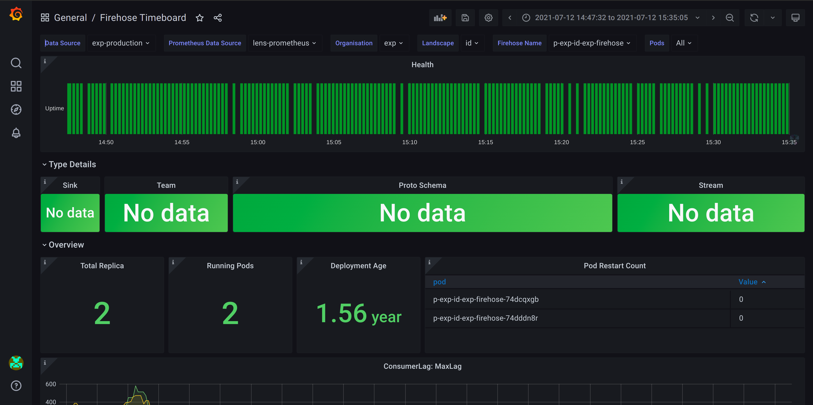
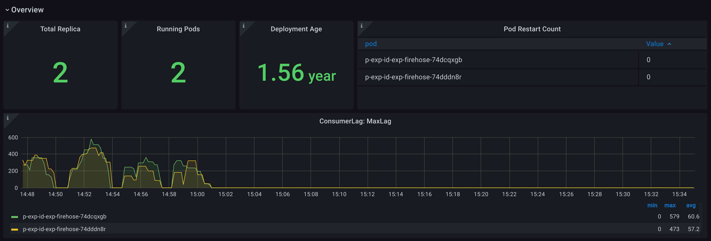
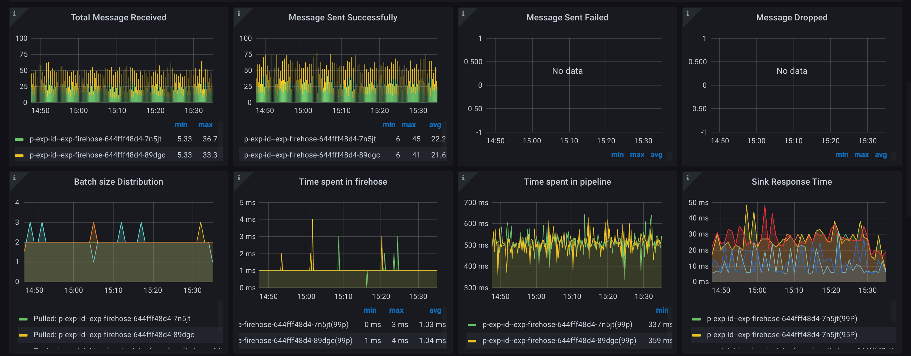
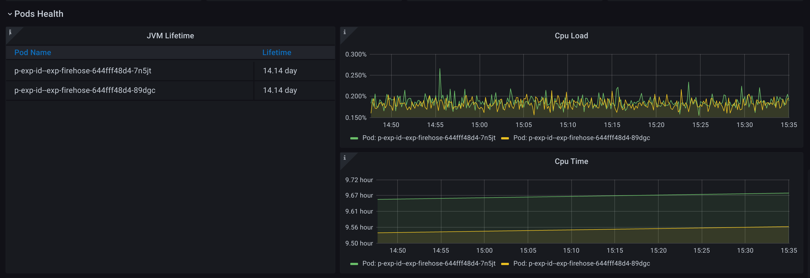
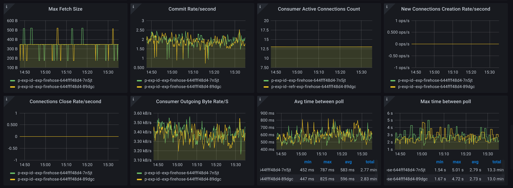
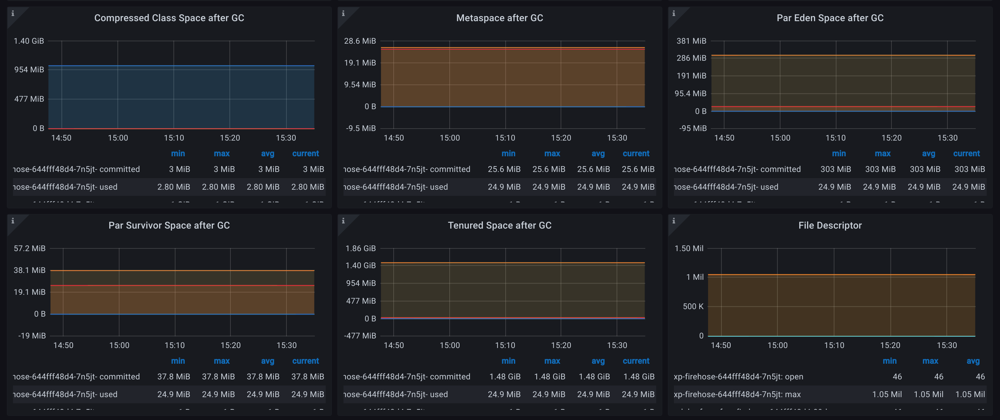

# Monitoring

Firehose provides a detailed health dashboard \(Grafana\) for effortless monitoring. Always know what’s going on with your deployment with built-in monitoring of throughput, response times, errors and more.

The Firehose Grafana dashboard provides detailed visualization of all Firehose metrics. For further details on each metric, please refer the [Metrics](../reference/metrics.md) section.

## Flow of Metrics from Firehose to Grafana


### StatsD Client

StatsD is a simple protocol for sending application metrics via UDP. StatsD is simple and has a tiny footprint. It can’t crash your application and has become the standard for large-scale metric collection. Firehose uses the [StatsD client](https://github.com/tim-group/java-statsd-client) library to send metrics to the Telegraf StatsD host.

### Telegraf

[Telegraf](https://www.influxdata.com/time-series-platform/telegraf/) is an agent written in Go and accepts StatsD protocol metrics over UDP. It works as a metrics aggregator and then periodically flushes the metrics to InfluxDB database. Telegraf is deployed in a container along with Firehose container in the Kubernetes pod.

### InfluxDB

[InfluxDB](https://www.influxdata.com/) is a time-series database where all Firehose metrics are stored. It accepts metrics flushed from the Telegraf agent. InfluxDB stores the metrics along with corresponding metric tags, e.g. - `SUCCESS_TAG` , `FAILURE_TAG` InfluxDB is deployed on a separate Kubernetes cluster.

### Grafana

[Grafana](https://grafana.com/) is a multi-platform open-source analytics and interactive visualization web app. It pulls metrics data from the InfluxDB database and provides detailed visualization of all Firehose metrics in real-time. Metrics visualization can be obtained for all or specific pods.

## Setting Up Grafana with Firehose

### Set Up Grafana service

Create a [Grafana Cloud](https://grafana.com/products/cloud/) account, to set up Grafana metrics dashboard on the cloud, or [download Grafana ](https://grafana.com/grafana/download)to set up Grafana dashboard locally. Grafana can also be deployed on Docker by pulling InfluxDB image from DockerHub.

```text
$ docker pull grafana/grafana
```

Grafana server runs on `localhost:3000` by default. Make sure to add your InfluxDB server as the data source in Grafana Data Sources section.

If your using InfluxDB version 1.8 or earlier, then Grafana dashboard can be loaded on your Grafana cloud account or local Grafana server by importing the JSON file `firehose-grafana-dashboard-updated.json` in the `docs/assets/` directory of the Firehose.

Make sure to select InfluxQL as the query language while configuring the InfluxDB as the Grafana data source, since the InfluxDB queries for the Firehose metrics in the `firehose-grafana-dashboard-updated.json` currently support only InfluxDB 1.x. Then provide the InfluxDB login credentials and other parameters like organization name and bucket name.

### Set Up InfluxDB Server

Follow [this guide](https://grafana.com/docs/grafana/latest/getting-started/getting-started-influxdb/) to set up and link your InfluxDB database with Grafana. InfluxDB can be installed locally or can be set up on the cloud via [InfluxDB Cloud](https://www.influxdata.com/products/influxdb-cloud/). For local setup, InfluxDB installer can be downloaded from [here](https://portal.influxdata.com/downloads/). InfluxDB can also be deployed on Docker by pulling InfluxDB image from DockerHub. The following command will pull the InfluxDb 2.x latest version.

```text
$ docker pull influxdb
```

For compatibity with the sample Firehose Grafana dashboard \(which current only supports InfluxQL query language\), you must download and install InfluxDB 1.x . To deploy InfluxDB 1.x on Docker, run the following to pull the image from Docker Hub.

```text
$ docker pull influxdb:1.8
```

Make sure to add the InfluxDB server URLs, port and the login credentials to the `telegraf.conf` file. By default, InfluxDB server is hosted on `localhost:8086` . Create a new bucket for the Firehose metrics and configure the bucket name in the `telegraf.conf` file, as well as in the InfluxDB source properties in the Grafana Data Sources section

The Telegraf output plugin configuration for InfluxDB v2 + can be found [here](https://github.com/influxdata/telegraf/tree/release-1.14/plugins/outputs/influxdb_v2). The Telegraf output plugin configuration for InfluxDB v1.x can be found [here](https://github.com/influxdata/telegraf/tree/master/plugins/outputs/influxdb).

### Set Up Telegraf Server

Lastly, set up Telegraf to send metrics to InfluxDB, following the corresponding instructions according to your Firehose deployment -

#### **Firehose in Docker or deployed locally**

1. Follow [this guide](https://www.influxdata.com/blog/getting-started-with-sending-statsd-metrics-to-telegraf-influxdb/) to install and set up Telegraf as the StatsD host. For a sample Telegraf file, needed for Firehose  you may refer the `telegraf.conf` file in `docs/assets/` 
2. Configure the Firehose environment variables `METRIC_STATSD_HOST` and `METRIC_STATSD_PORT`  to the IP address and port on which Telegraf is listening. By default, `METRIC_STATSD_HOST` is set to `localhost` and `METRIC_STATSD_PORT` is set to the default listener port of Telegraf, i.e.`8125` 
3. In `telegraf.conf`, check these 2 configs in INPUT PLUGINS in the StatsD plugin configuration, set `datadog_extensions = true` and `datadog_distributions = true`
4. Configure the URL and port of the InfluxDB server in the Telegraf configuration file, i.e.`~/.telegraf/telegraf.conf`


#### Firehose deployed on Kubernetes _\*\*_

1. Follow[ this guide](https://github.com/odpf/charts/tree/main/stable/firehose#readme) for deploying Firehose on a Kubernetes cluster using a Helm chart. 
2. Configure the following parameters in the default [values.yaml](https://github.com/odpf/charts/blob/main/stable/firehose/values.yaml) file and run - 

```text
$ helm install my-release -f values.yaml odpf/firehose
```

| Key | Type | Default | Description |
| :--- | :--- | :--- | :--- |
| telegraf.config.output.influxdb.database | string | `"test-db"` | db name for telegraf influxdb output |
| telegraf.config.output.influxdb.enabled | bool | `false` | flag for enabling telegraf influxdb output |
| telegraf.config.output.influxdb.retention\_policy | string | `"autogen"` | retention policy for telegraf influxdb output |
| telegraf.config.output.influxdb.urls | list | `["http://localhost:8086"]` | influxdb urls for telegraf output |
| telegraf.enabled | bool | `false` | flag for enabling telegraf |

## Grafana Dashboard

[Grafana](https://grafana.com/) is a multi-platform open-source analytics and interactive visualization web application. It provides charts, graphs, and alerts for the web when connected to supported data sources. A licensed Grafana Enterprise version with additional capabilities is also available as a self-hosted installation or an account on the Grafana Labs cloud service.

Grafana dashboard can be loaded on your Grafana cloud account by importing the JSON file `firehose-grafana-dashboard-updated.json` in the `docs/assets/` directory.




Load a Firehose dashboard by configuring the following parameters -

* **Data Source** - name of InfluxDB database for metrics
* **Prometheus Data Source** - Prometheus cluster name if any
* **Organization** - name of the InfluxDB organization
* **Firehose Name** - the Firehose Kafka Consumer Group ID
* **Pod** - specify a particular Kubernetes pod ID or select **All** to track all pods.

## Features of Grafana dashboard

* metrics of every pod at any point of time can be obtained by hovering over that time coordinate.
* each pod has its own color code to distinguish it from other pods, in the visualization graph.
* minimum, maximum, and average values of the metrics are displayed for every pod.

## Dashboard Sections

### Type Details


### Overview





### Pods Health



### Kafka Consumer Details





### Error


### Memory


### Garbage Collection




### Retry


### HTTP Sink


### Filter


